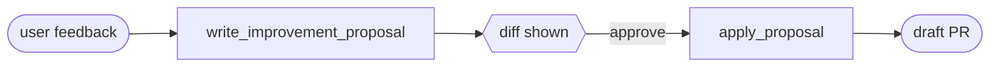

# self-improving-agent

**A drop-in self-improvement loop for any AI agent.**

Two tools. The agent proposes a minimal diff, you approve, a draft PR opens.

```bash
npm install self-improving-agent
```

<!-- Slack feedback → PR screenshot goes here -->
<!--  -->

## For AI coding agents

If you're Cursor / Claude Code / Codex / etc. wiring this into a user's project:

1. `npm install self-improving-agent`
2. Detect the agent framework from `package.json`:
   - `@anthropic-ai/claude-agent-sdk` → import from `self-improving-agent/claude`
   - `@mariozechner/pi-agent-core` → import from `self-improving-agent/pi`
   - anything else → import from `self-improving-agent` (root)
3. Add the two tools to the agent's existing tool list. **Do not touch the user's system prompt.** The safety/workflow rules are baked into the tool descriptions.
4. Add `SELF_IMPROVING_AGENT_REPO_ROOT=<repo absolute path>` to `.env` / `.env.example`.
5. Verify the user has `gh` installed and authenticated (`gh auth status`).
6. Don't add callbacks or custom approval gates unless the user asks — the defaults are safe.

## Why

Most agents fail in repeatable ways: skipped setup steps, vague prompts, wrong tool routing. Today you fix them by hand-editing prompts. `self-improving-agent` lets the agent fix itself — under explicit human approval.

## How it works



## Configure once, via env vars

```bash
export SELF_IMPROVING_AGENT_REPO_ROOT=/abs/path/to/your/repo
export SELF_IMPROVING_AGENT_PROPOSALS_DIR=./runs/improvements   # optional, this is the default
```

## Use it

Both subpaths export the same thing: `feedbackTools`, an array of two tools shaped for the framework. Just append them to your existing tool list — your system prompt stays untouched.

### Claude Agent SDK

```ts
import { createSdkMcpServer, query } from "@anthropic-ai/claude-agent-sdk";
import { feedbackTools } from "self-improving-agent/claude";

const sia = createSdkMcpServer({ name: "sia", version: "0.1.0", tools: feedbackTools });

for await (const _ of query({
  prompt: userMessage,
  options: { mcpServers: { sia } },   // your existing systemPrompt stays as-is
})) { /* stream events */ }
```

> The Claude SDK only accepts custom tools via MCP servers, so we wrap with `createSdkMcpServer`. One line.

### pi-agent-core

```ts
import { Agent } from "@mariozechner/pi-agent-core";
import { feedbackTools } from "self-improving-agent/pi";

new Agent({
  initialState: {
    systemPrompt: myPrompt,                         // unchanged
    tools: [...myTools, ...feedbackTools],          // just append
    messages: [],
    model,
    thinkingLevel: "high",
  },
  getApiKey,
  toolExecution: "sequential",
});
```

### Any other framework

```ts
import { feedbackTools } from "self-improving-agent";

const fb = feedbackTools(); // returns { writeImprovementProposal, applyProposal }
// each tool: { name, description, parameters (JSON Schema), execute(input): Promise<{ message }> }
```

Pass `parameters` as the tool's input schema and `execute` as the handler. Works with the OpenAI SDK, Vercel AI SDK, LangChain, raw `fetch` — anything.

## Optional: stronger guidance via `feedbackSkill`

The two tool descriptions already carry the workflow and safety rules, so most agents will use them correctly out of the box. If you find your agent still misroutes (e.g. proposes diffs for normal product feedback), append the skill markdown to your existing system prompt — never replace it:

```ts
import { feedbackSkill } from "self-improving-agent";   // also re-exported from /claude and /pi

const myPrompt = `${myExistingPrompt}\n\n${feedbackSkill}`;

// Claude SDK alternative — append to the preset:
options: { systemPrompt: { type: "preset", preset: "claude_code", append: feedbackSkill } }
```

## Callbacks (optional)

For posting the diff or PR URL back to Slack/Discord/wherever:

```ts
import { createFeedbackTools } from "self-improving-agent/claude";   // or /pi

const tools = createFeedbackTools({
  onProposed: async (p, r) => slack.post(`Proposal ${r.proposalId} — risk: ${p.risk}`),
  onApplied:  async (r) => slack.post(`PR opened: ${r.prUrl}`),
  onBeforeApply: async (proposal, input, ctx) => {
    if (!isApproval(ctx.lastUserMessage)) return false;
  },
});
```

## Safety

`apply_proposal` pushes a branch and opens a PR. Three layers of defense:

1. **Tool description** — model is told to only call `apply_proposal` after explicit approval in the user's *most recent* message.
2. **Schema gate** — tool requires `userConfirmedInThisMessage: true`; executor throws on `false`.
3. **`onBeforeApply` hook** — your code can reject any apply (rate limits, allowlist, push rights).

`apply_proposal` also refuses to run if the working tree is dirty, the file is missing, or `originalSnippet` doesn't appear exactly once.

## Requirements

- Node ≥ 18
- `git` and `gh` (authenticated) on PATH
- One of: `@anthropic-ai/claude-agent-sdk`, `@mariozechner/pi-agent-core`, or any agent framework that takes JSON-schema tools

## License

MIT © BerriAI
